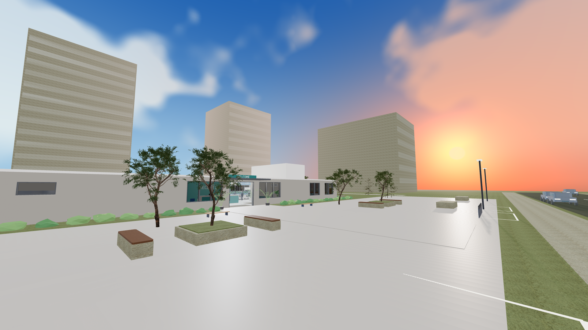
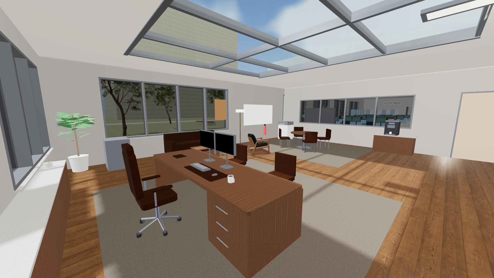
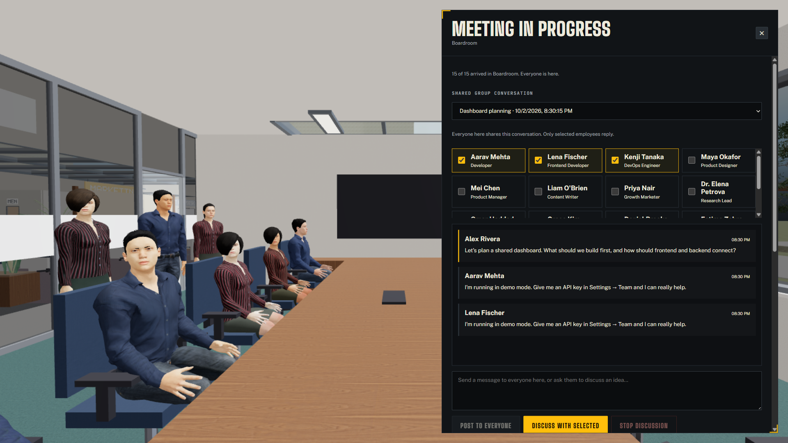
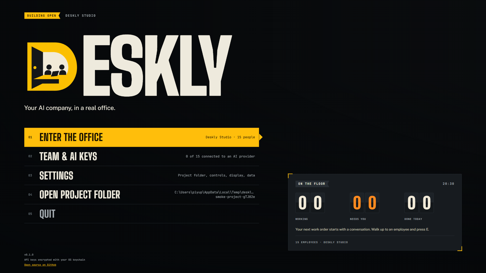
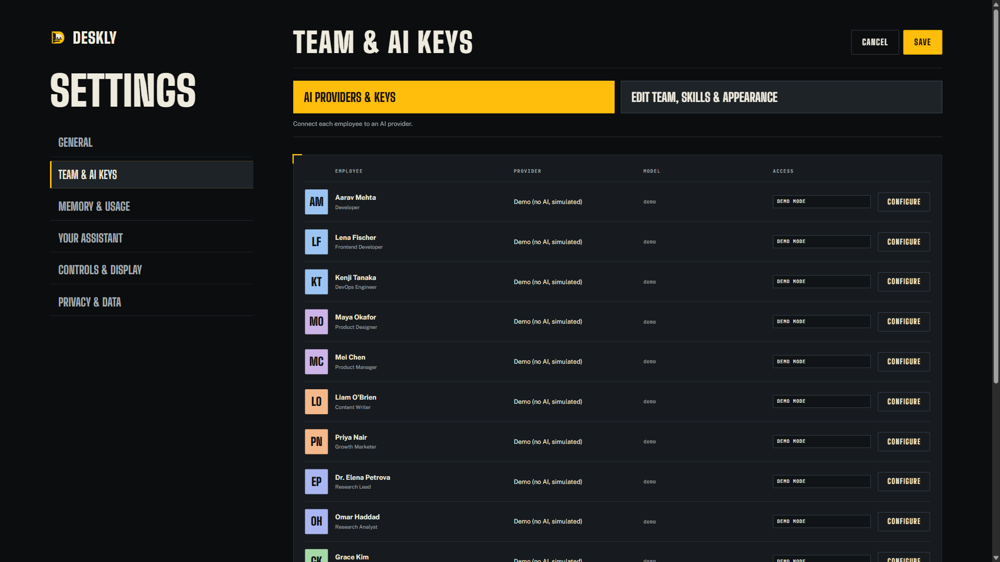
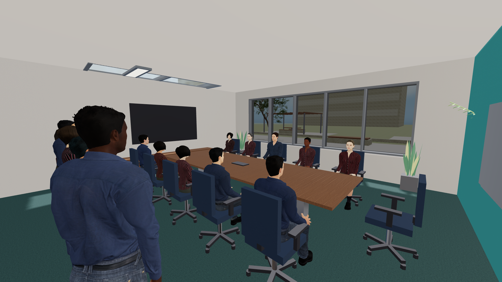
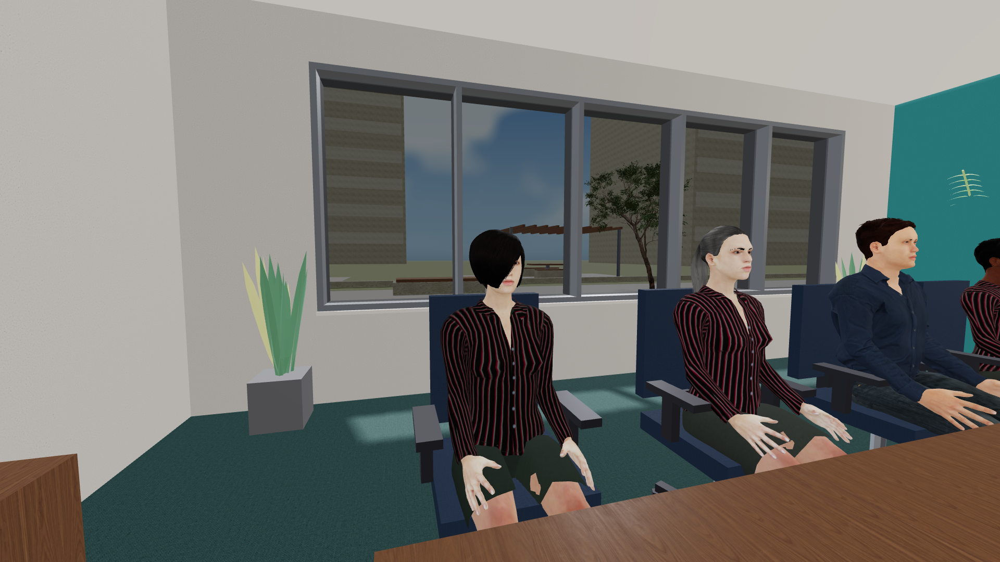
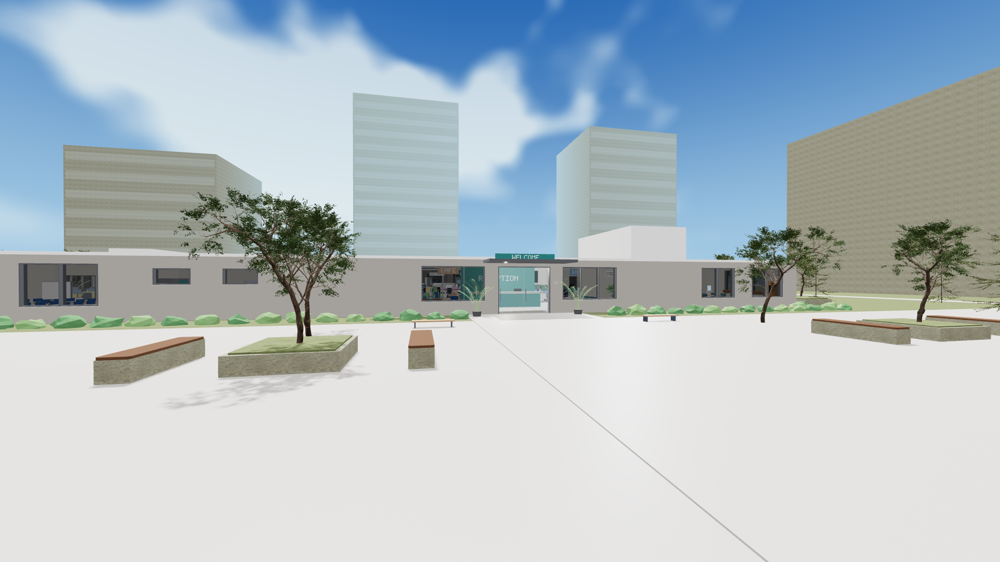
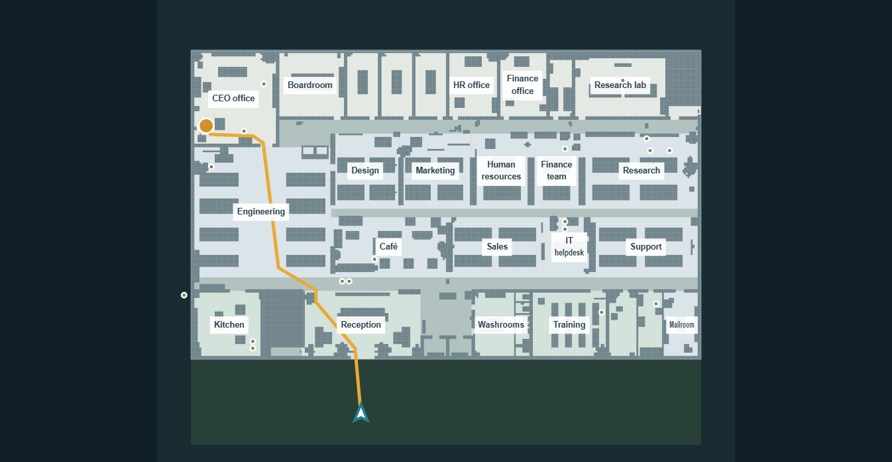
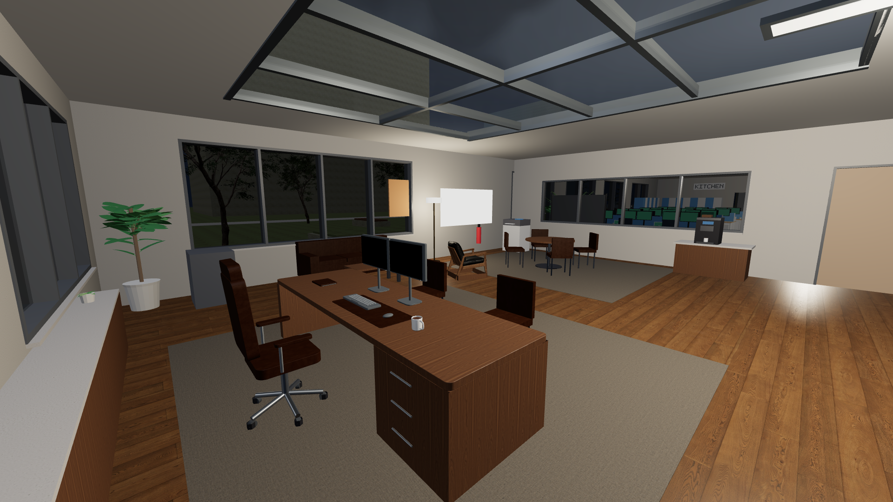

<div align="center">


<br>

[](https://github.com/Priyanshu-1622/Deskly/actions/workflows/ci.yml)


[](https://github.com/Priyanshu-1622/Deskly/commits/main)

**Walk through a 3D office, give AI teammates work on your project, and review what they build.**

[Get started](#get-started) · [See the app](#inside-deskly) · [How it works](#how-work-moves-through-deskly) · [Safety and limits](#safety-and-current-limits)

</div>

Deskly is an open-source, first-person **desktop app** built with Electron. You can hire a team, customize each employee's role and instructions, assign real project tasks, and work from your own laptop in the office. Employees use AI for assigned work, conversations, and meetings; ordinary office movement makes no AI calls. Choose an installed Codex or Claude Code login, a hosted API provider, a local model, or demo mode with simulated tasks.

> [!NOTE]
> Deskly is a working prototype. The screens below come from the actual Windows app using a sample company and demo mode. AI output quality, cost savings, and cross-platform packages have not been validated for a production release.

## Inside Deskly

<p align="center">
  
  <br><sub>Call the whole team to the boardroom, take your seat, and lead the meeting.</sub>
</p>

<table>
  <tr>
    <td width="50%"></td>
    <td width="50%"></td>
  </tr>
  <tr><td><b>A changing office day.</b> Regional time drives sun, clouds, sunset and night.</td><td><b>Your private workspace.</b> Use the laptop, whiteboard, coffee station and briefing area.</td></tr>
</table>

<p align="center">
  
  <br><sub>One conversation for the room. Select who replies, keep shared history, and save confirmed decisions. This screenshot uses demo replies.</sub>
</p>

<details>
  <summary>See the redesigned menu and team settings</summary>
  <br>
  <br>
</details>

<details>
  <summary>Explore the current office and updated employees</summary>
  <br>
  <br>
  <br>
</details>

<details>
  <summary>Find rooms and keep working after dark</summary>
  <br>
  <br>
</details>

## What is working today

| Area | What you can do |
| --- | --- |
| 3D office | Walk in first person through the original office model with photographed PBR surfaces. A clear, signed aisle leads to an expanded CEO office with a briefing table, whiteboard, display, coffee station, printer, report archive, and switchable lamp. Sit in available chairs, use room whiteboards, printers, presentation screens, drinks, meetings, the operations board, and your laptop. Footsteps, drinks, doors, chairs, and office objects have local sound effects with a volume control. Idle employees animate without making AI calls. |
| Office day | Use the real date and time for your device or select one of ten world regions in Settings. The sky changes through sunrise, daylight, sunset, and moonlit night; indoor lights respond. A fast preview lets you watch the cycle. Employees begin leaving at 18:00. Call the whole team back and keep them through the night and across restarts until you send them home. |
| Office atlas | Search rooms, people and facilities; pan, zoom, locate yourself, and choose a walkable route that remains on the minimap. |
| Freeboards | Add local images, notes and links to movable, resizable cards. Boards save on your device and show their contents in the 3D office. Open them from the laptop, map or physical board. |
| First day | An optional introduction explains movement, projects, approvals, meetings and shifts. Replay it any time with H or F1. |
| Your team | Hire from role presets, edit work instructions and appearance, and inspect a skills and knowledge resume for each employee. |
| Group discussions | Talk to everyone in a meeting or a small group in your CEO office. Post without AI calls, select who replies, and let speakers read one another's earlier replies. Stop a round, reopen saved project conversations, and save confirmed decisions to every participant's project memory. |
| AI providers | Configure Anthropic, OpenAI, Gemini, OpenRouter, Ollama, an OpenAI-compatible endpoint, or an installed Codex or Claude Code login per employee. The laptop assistant can use a separate setup. |
| Project work | Assign tasks against one selected project folder. Deskly records a project map and gives each role a home for new files, such as frontend/ or backend/. Existing layouts are adopted without moving files. Interrupted work can resume from its saved checkpoint. |
| Coordination | Keep typed project notes with verification status, approved cross-project notes, file claims, and teammate handoffs with contracts and dependencies. Only verified memory enters active-task prompts; pending notes stay visible for founder review. |
| Cost controls | Use an optional lightweight model for planning and conversation, see provider usage, and set a monthly token ceiling. The target of 60–70% savings is **not yet measured**. |
| Oversight | Review full file content, shell commands and external action requests before approval. Sensitive configuration edits always require review. See current tasks and an audit log on the operations board. |

Each role ships with a detailed default playbook, and you can replace it for any employee in **Team & AI keys → Work instructions**. [Read the agent architecture](AGENT_ARCHITECTURE.md) for memory, coordination, and cost details.

The original single-floor office is retained, with outdoor grounds, streets, parked cars, trees, courtyard seating and a fountain. [Outdoor grounds and performance details](docs/OUTDOOR-GROUNDS.md). Automatic rendering scale, shared outdoor geometry, batched trees, fewer simultaneous lights and reduced distant skeleton and HUD updates help keep movement smooth. Detailed employee models, face and hair customization, corrected walking and neck poses, staggered recalls, glass skylights, refined CEO furniture, CLI sign-ins, resumable tasks, verified memory, structured project areas and office sounds remain available. The current source passes 86 automated checks. A desktop discussion check covers all 15 employees, selected replies, shared decisions, a two-person CEO discussion, a missing API key, and reopening history without renderer errors.

### Lead a shared discussion

Press **C** or **M**, choose a room and participants, and call them over. Press **C** or **M** again to open the shared conversation. **Post to everyone** saves your message without calling AI. Select speakers and choose **Discuss with selected** for one reply each, in order; later speakers see earlier replies. Leave the composer empty to discuss your latest posted message. Nothing starts an endless automatic conversation.

Use **Save shared decision** for facts the group has agreed on; these enter each participant's verified memory for the selected project. Ordinary suggestions stay in the conversation history. **Stop discussion** cancels the round; **End and save meeting** keeps the transcript and existing room notes. The saved conversation selector shows discussions with the same room and participants in the current project. This feature discusses work; assign executable tasks through the employee task controls.

## Get started

You need **Node.js 22.13+** and npm. Windows is the currently tested desktop target; macOS and Linux package targets are configured but still need verification.

```bash
git clone https://github.com/Priyanshu-1622/Deskly.git
cd Deskly
npm ci
npm start
```

On first launch, the setup wizard asks for your name, company, project folder, team, and laptop assistant. Start in **demo mode** to explore without an API key. To make employees do real AI work, choose a provider in **Team & AI keys**. Codex CLI and Claude Code can use their installed sign-ins after you install and sign into the respective CLI; use **Check installed login** to verify. Other hosted providers use an API key, and Ollama uses a local endpoint. API keys are stored through Electron's encrypted OS storage when available.

When you assign the first task in a project, Deskly creates `deskly.project.json` in that project's root. A new empty project also gets `frontend/`, `backend/`, `shared/`, `docs/`, and `operations/`. For an existing project, the map uses recognized folders such as `apps/web` and `apps/api` and leaves existing files in place. You can edit the paths in `deskly.project.json` for your layout; the next task reads the updated map. Each task card shows its assigned area. New files must go in that area or an agreed shared/configuration path; employees can still edit existing files when integration requires it.

```bash
npm run check     # lint plus automated runtime and UI tests
npm run smoke     # isolated desktop rendering check
npm audit         # include desktop/build dependencies
npm run dev       # app with developer tools
npm run dist:win  # build the Windows installer into dist/
```

The repository also declares `dist:mac` and `dist:linux` targets. Run those on their respective platforms once packaging has been verified there.

Source pushes run checks without packaging or uploading an app. Packaging workflows require a manual dispatch. Old local installers and unpacked apps are excluded from the repository; use the source instructions above until a new approved package is released.

### Controls

| Key | Action |
| --- | --- |
| **W A S D** / **Shift** | Walk / move faster |
| **Mouse** | Look around; click the office view to capture the pointer |
| **E** | Talk, interact, or sit in an available chair |
| **F** / **R** | Drink what you are holding / discard the cup |
| **P** | Toggle a clean photo mode |
| **L** | Open your laptop |
| **Tab** / **T** | Open the operations board / tasks |
| **G** | Open or close the office atlas |
| **B** | Open office whiteboards |
| **N** | Open team and night recall controls |
| **H** / **F1** | Replay the first-day guide |
| **Backspace** | Clear the walking route |
| **C** | Call people to your office or a meeting room |
| **M** | Start a meeting |
| **W A S D** while seated | Stand up and return to where you sat down |
| **Esc** | Close a panel or pause |
| **F11** | Full screen |

## How work moves through Deskly

```text
You assign a task
      ↓
The employee plans and checks relevant project memory
      ↓
The employee works in your project folder and shares file claims / handoffs
      ↓
Commands or external actions wait for your approval
      ↓
You review the result, touched files, and audit trail
```

Idle office animations make no AI calls. Assigned work, employee conversations, meetings, and the laptop assistant can use AI. Plans and short conversations can use a cheaper model, while execution uses the employee's main model. Usage metering and a monthly ceiling help control cost; actual spend still depends on the provider and tasks. Installed CLI connectors currently start a fresh process for each model turn, so long tasks can have substantial prompt overhead.

## Safety and current limits

- Project file tools stay within the chosen folder and reject symbolic link paths and common secret filenames. This does **not** sandbox the entire app.
- API keys are encrypted with Electron `safeStorage` and bound to their provider and endpoint. Changing the endpoint requires a matching key; a previous key is not forwarded. Saving a key fails if secure storage is unavailable.
- Approved shell commands run with your OS permissions and can reach outside the project folder. Review the full command and working directory. Secret environment variables are excluded; cancellation and quit stop the process tree.
- Email, publishing, deployment, and payment requests are approval-gated and recorded. Deskly does not execute those external actions yet.
- Default employees use textured, skinned character models with procedural animation. Further clothing options, facial animation, and movement refinement are still in progress.
- New offices request approval for file writes by default. Sensitive configuration and existing files outside the assigned area always require review.
- Damaged local data is preserved for recovery; interrupted checkpoints expire after three days. Privacy settings can erase all Deskly data while keeping project files.
- Deskly is a prototype. Review the implementation and keep backups before allowing it to edit an important project. [Release gates and update policy](RELEASE_POLICY.md) describe the remaining signing, platform and live-provider checks.

Deskly now includes detailed, customizable employee models with textured faces, eyes, hair and clothing; authored exterior trees; and a full roof with glass skylights. The CEO workstation has detailed furniture, dedicated leather maps, filtered reflections and sun shadows. Further wardrobe, facial animation and wider furniture refinement are in progress. [See the realism direction](docs/REALISM_DIRECTION.md) and [asset credits / character intake](docs/ASSET_CREDITS.md) for the current scope and source assets.

## Project map

| Path | Purpose |
| --- | --- |
| `src/main/` | Electron window, secure storage, provider adapters, task runtime, workspace tools |
| `src/renderer/` | 3D office, first-person controls, employees, screens, and laptop |
| `tools/build_office.py` | Generates the office world assets |
| `test/` | Runtime and UI tests |
| `docs/` | README artwork and real app screenshots |

The agent loop and its current limitations are described in [AGENT_ARCHITECTURE.md](AGENT_ARCHITECTURE.md). Contributions and issue reports are welcome.

## License

[MIT](LICENSE) © Priyanshu Patel
## Office map and brainstorming

Click the bottom-left map or press **G** for the office atlas: room, teammate and facility filters, sharp floor plan, drag to pan, scroll to zoom, player locator and walking routes that remain on the minimap. **B** opens whiteboards, **N** the team, **T** tasks, **H / F1** the guide, and **Backspace** clears your route.

Interact with an office whiteboard using **E**, or choose **Whiteboards** on the laptop or map. Add movable, resizable notes, images and links. Boards save locally and show their contents on the physical office boards. Export a JSON backup from the editor.

To keep everyone at the office overnight, use **Tab → Team → Call everyone back · keep here**. This hold continues across nights and restarts until you send them home; idle workers do not make AI calls.

See [the public release plan](docs/PUBLIC-RELEASE-PLAN.md) for the remaining onboarding, installer, accessibility and real AI verification work.
