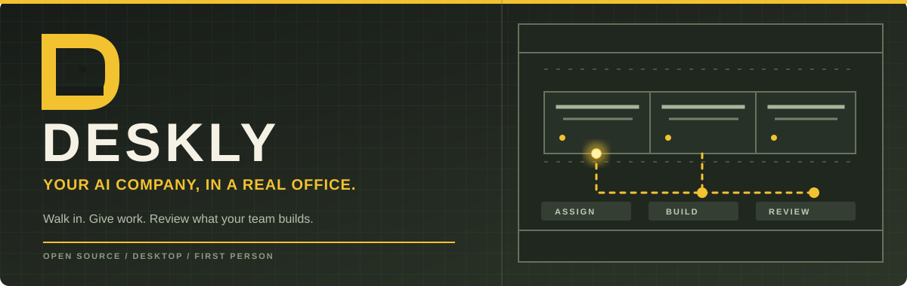
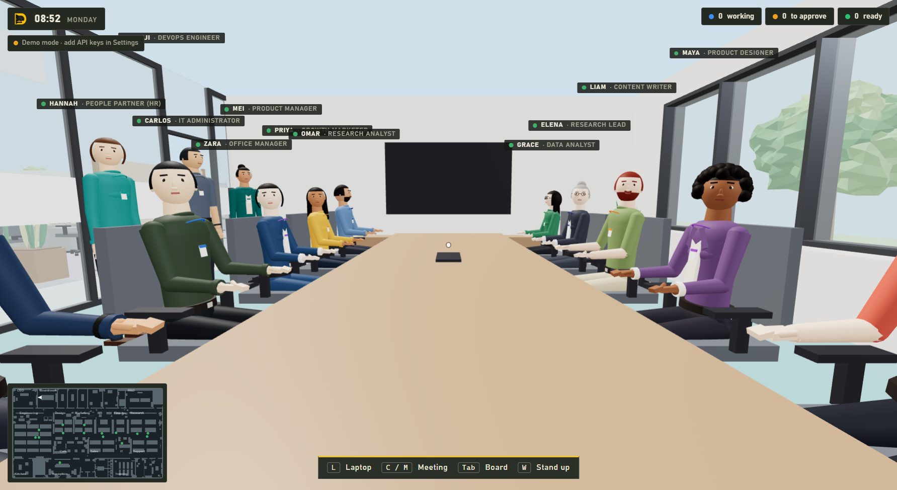
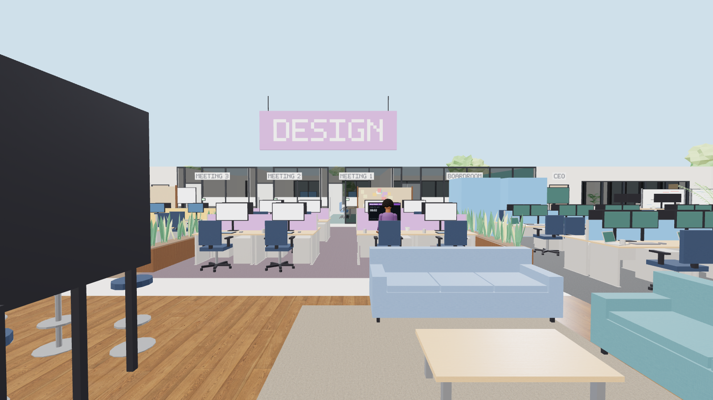
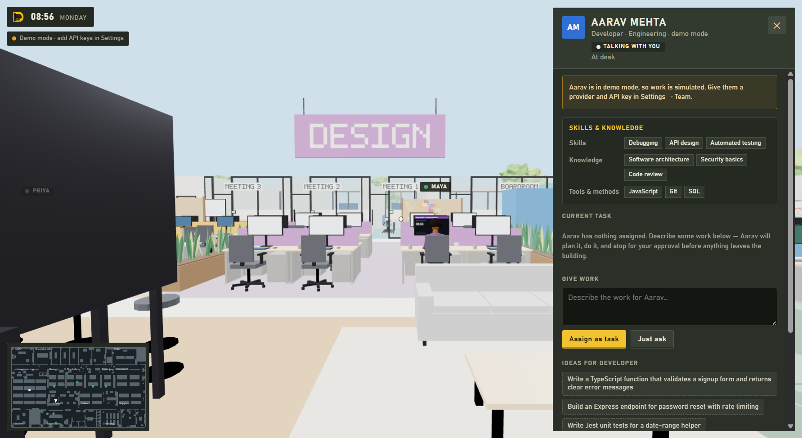
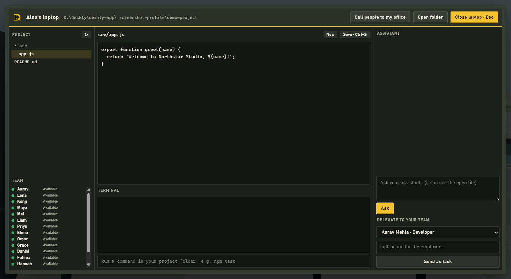

<div align="center">



<br>

[](https://github.com/Priyanshu-1622/Deskly/actions/workflows/ci.yml)


[](https://github.com/Priyanshu-1622/Deskly/commits/main)

**Walk through a 3D office, give AI teammates work on your project, and review what they build.**

[Get started](#get-started) · [See the app](#inside-deskly) · [How it works](#how-work-moves-through-deskly) · [Safety and limits](#safety-and-current-limits)

</div>

Deskly is an open-source, first-person **desktop app** built with Electron. You can hire a team, customize each employee's role and instructions, assign real project tasks, and work from your own laptop in the office. Employees only call an AI provider when they have work to do. Without a key, the office runs in demo mode with simulated tasks.

> [!NOTE]
> Deskly is a working prototype. The screens below come from the actual Windows app using a sample company and demo mode. AI output quality, cost savings, and cross-platform packages have not been validated for a production release.

## Inside Deskly

<p align="center">
  
  <br><sub>Call the whole team to the boardroom, take your seat, and lead the meeting.</sub>
</p>

<details>
  <summary>See the office floor</summary>
  <br>
</details>

<table>
  <tr>
    <td width="50%"></td>
    <td width="50%"></td>
  </tr>
  <tr><td><b>Meet your team.</b> Each person has skills, knowledge, editable work instructions, an AI setup, and a task history.</td><td><b>Work from your desk.</b> Browse and edit your project, use a terminal, ask your assistant, or delegate to an employee.</td></tr>
</table>

## What is working today

| Area | What you can do |
| --- | --- |
| 3D office | Walk in first person; meet employees at their desks; sit in an available meeting chair; use the operations board, rooms, meetings, and your laptop. Idle employees animate without making AI calls. |
| Your team | Hire from role presets, edit work instructions and appearance, and inspect a skills and knowledge resume for each employee. |
| AI providers | Configure Anthropic, OpenAI, Gemini, OpenRouter, Ollama, or an OpenAI-compatible endpoint per employee. The laptop assistant can use a separate setup. |
| Project work | Assign tasks against a selected project folder. An employee plans, reads and writes files, reports progress, and returns a result for review. |
| Coordination | Keep project notes, approved cross-project notes, file claims, and teammate handoffs. Relevant memory is retrieved for active tasks. |
| Cost controls | Use an optional lightweight model for planning and conversation, see provider usage, and set a monthly token ceiling. The target of 60–70% savings is **not yet measured**. |
| Oversight | Review shell commands and external action requests before approval. See current tasks and an audit log on the operations board. |

Each role ships with a detailed default playbook, and you can replace it for any employee in **Team & AI keys → Work instructions**. [Read the agent architecture](AGENT_ARCHITECTURE.md) for memory, coordination, and cost details.

## Get started

You need **Node.js 22+** and npm. Windows is the currently tested desktop target; macOS and Linux package targets are configured but still need verification.

```bash
git clone https://github.com/Priyanshu-1622/Deskly.git
cd Deskly
npm ci
npm start
```

On first launch, the setup wizard asks for your name, company, project folder, team, and laptop assistant. Start in **demo mode** to explore without an API key. To make employees do real AI work, add a supported provider and key in **Team & AI keys**. Ollama uses a local endpoint. API keys are stored through Electron's encrypted OS storage when available.

```bash
npm test          # automated runtime and UI tests
npm run dev       # app with developer tools
npm run dist:win  # build the Windows installer into dist/
```

The repository also declares `dist:mac` and `dist:linux` targets. Run those on their respective platforms once packaging has been verified there.

### Controls

| Key | Action |
| --- | --- |
| **W A S D** / **Shift** | Walk / move faster |
| **Mouse** | Look around; click the office view to capture the pointer |
| **E** | Talk, interact, or sit in an available chair |
| **L** | Open your laptop |
| **Tab** | Open the operations board |
| **C** | Call people to your office or a meeting room |
| **M** | Start a meeting |
| **W A S D** while seated | Stand up and return to where you sat down |
| **Esc** | Close a panel or pause |
| **F11** | Full screen |

## How work moves through Deskly

```text
You assign a task
      ↓
The employee plans and checks relevant project memory
      ↓
The employee works in your project folder and shares file claims / handoffs
      ↓
Commands or external actions wait for your approval
      ↓
You review the result, touched files, and audit trail
```

Only employees with an active task use AI calls. Plans and short conversations can use a cheaper model, while execution uses the employee's main model. Usage metering and a monthly ceiling help control cost; actual spend still depends on the provider and tasks.

## Safety and current limits

- Project file tools stay within the chosen folder and reject symbolic link paths and common secret filenames. This does **not** sandbox the entire app.
- API keys are encrypted with Electron `safeStorage`; saving a key fails if secure storage is unavailable.
- Approved shell commands run with your OS permissions and can reach outside the project folder. Read the full command before approving it.
- Email, publishing, deployment, and payment requests are approval-gated and recorded. Deskly does not execute those external actions yet.
- The 3D people are procedural characters. The office and app are playable, but visuals and interaction still need refinement.
- Deskly is a prototype. Review the implementation and keep backups before allowing it to edit an important project.

## Project map

| Path | Purpose |
| --- | --- |
| `src/main/` | Electron window, secure storage, provider adapters, task runtime, workspace tools |
| `src/renderer/` | 3D office, first-person controls, employees, screens, and laptop |
| `tools/build_office.py` | Generates the office world assets |
| `test/` | Runtime and UI tests |
| `docs/` | README artwork and real app screenshots |

The agent loop and its current limitations are described in [AGENT_ARCHITECTURE.md](AGENT_ARCHITECTURE.md). Contributions and issue reports are welcome.

## License

[MIT](LICENSE) © Priyanshu Patel
